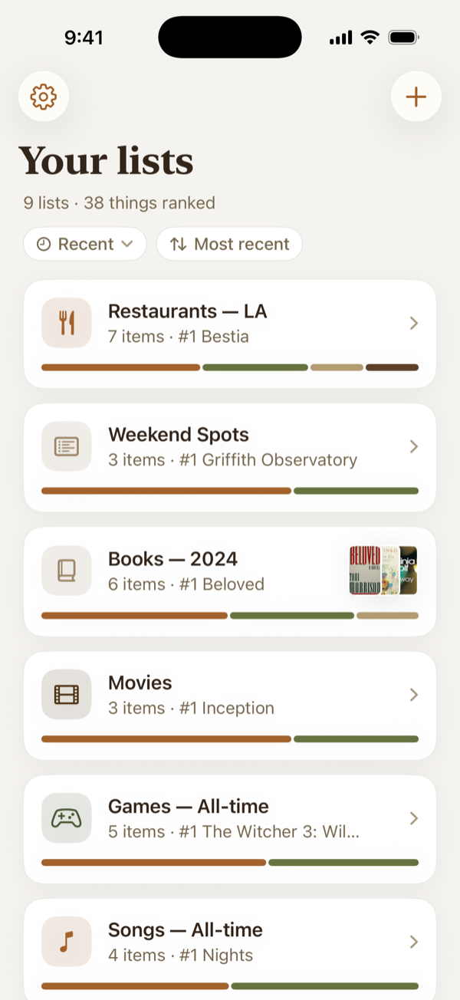
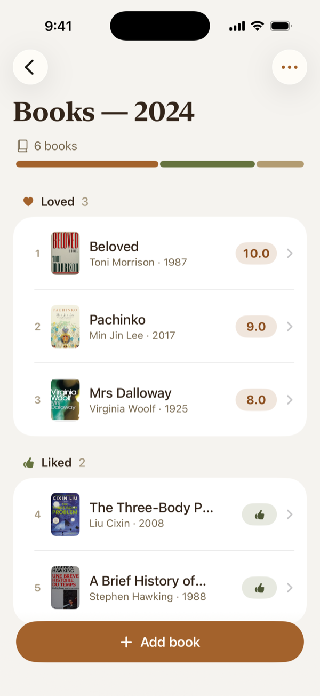
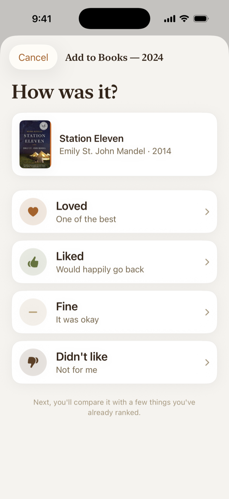
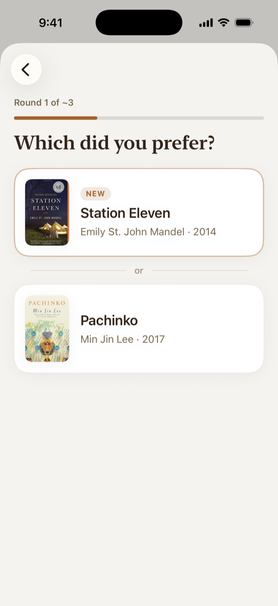
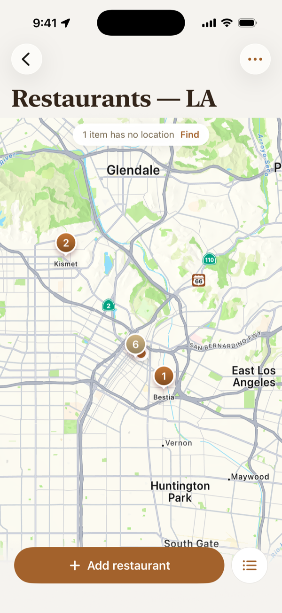
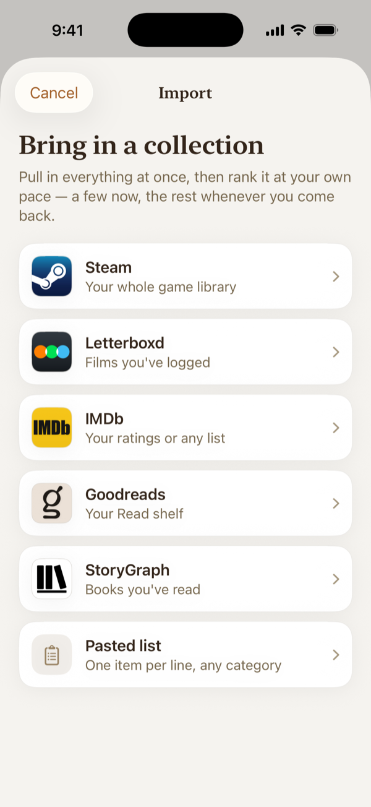

# AnyRank

iOS app for ranking things by direct comparison rather than absolute rating. See `Spec.md` for product requirements and `LocalDev.md` for local development guidance.

## Repository layout

```
anyrank/
├── Spec.md                 Product spec (single source of truth)
├── LocalDev.md             Local development & visual testing plan
├── BUILD_NOTES.md          What was built, what's stubbed
├── Project.yml             xcodegen config — generates AnyRank.xcodeproj
├── Secrets.xcconfig        Local secrets (gitignored)
├── Secrets.xcconfig.example Template — copy and fill in
├── docs/screenshots/       README screenshots (generated)
├── scripts/                Dev scripts (screenshots.sh, app-icon.swift)
├── AnyRank/                Source for the iOS app target
├── AnyRankTests/           Unit tests (ranking algorithm)
├── AnyRankSnapshotTests/   Snapshot tests (visual regression)
└── README.md               This file
```

<table>
<tr>
<td align="center" width="16%">
<picture>
  <source media="(prefers-color-scheme: dark)" srcset="docs/screenshots/home-dark.png">
  
</picture>
<br><sub>Your lists</sub>
</td>
<td align="center" width="16%">
<picture>
  <source media="(prefers-color-scheme: dark)" srcset="docs/screenshots/list-dark.png">
  
</picture>
<br><sub>A ranked list</sub>
</td>
<td align="center" width="16%">
<picture>
  <source media="(prefers-color-scheme: dark)" srcset="docs/screenshots/bucketPick-dark.png">
  
</picture>
<br><sub>Pick a bucket</sub>
</td>
<td align="center" width="16%">
<picture>
  <source media="(prefers-color-scheme: dark)" srcset="docs/screenshots/compare-dark.png">
  
</picture>
<br><sub>Compare head to head</sub>
</td>
<td align="center" width="16%">
<picture>
  <source media="(prefers-color-scheme: dark)" srcset="docs/screenshots/map-dark.png">
  
</picture>
<br><sub>Places on a map</sub>
</td>
<td align="center" width="16%">
<picture>
  <source media="(prefers-color-scheme: dark)" srcset="docs/screenshots/importSources-dark.png">
  
</picture>
<br><sub>Import a collection</sub>
</td>
</tr>
</table>

Screenshots match your GitHub theme. To regenerate them after a UI change, run `scripts/screenshots.sh` (see [Updating screenshots](#updating-screenshots)).

## Installing the dev build on your iPhone

AnyRank isn't on the App Store or TestFlight yet. To use it, build it from source and install it on your phone over a cable. You need a Mac with Xcode 16 or newer, an iPhone running iOS 18 or later, and an Apple ID. A free Apple ID works.

**1. Download the code.** Either clone the repo:

```bash
git clone https://github.com/elsmrna/anyrank.git
```

or download the source zip for a tagged version from the [Releases](https://github.com/elsmrna/anyrank/releases) page and unzip it.

**2. Generate the Xcode project.** From the repo folder:

```bash
brew install xcodegen
```

```bash
cp Secrets.xcconfig.example Secrets.xcconfig
```

```bash
xcodegen generate && open AnyRank.xcodeproj
```

You can leave every value in `Secrets.xcconfig` empty. Search and imports will use built-in sample data until you add keys (see [Configuring secrets](#configuring-secrets)).

**3. Make the bundle ID yours** (skip this if you're the repo owner). Bundle IDs are tied to one Apple account. In `Project.yml`, change `bundleIdPrefix` and `PRODUCT_BUNDLE_IDENTIFIER` to something unique, such as `com.yourname.anyrank`, then run `xcodegen generate` again.

**4. Sign it.** In Xcode, select the **AnyRank** target, open **Signing & Capabilities**, tick **Automatically manage signing**, and set **Team** to your Apple ID. If your Apple ID isn't listed, add it under **Xcode → Settings → Accounts**. `xcodegen generate` clears this setting. To keep it, copy the `DEVELOPMENT_TEAM` value from the target's build settings into `Secrets.xcconfig`.

**5. Prepare the phone** (first time only). Plug it in, unlock it, and tap **Trust This Computer**. Then turn on **Settings → Privacy & Security → Developer Mode** and let the phone restart.

**6. Install.** Choose your iPhone from the device menu at the top of Xcode and press **Cmd-R**. The first time, iOS blocks the app until you go to **Settings → General → VPN & Device Management**, tap your Apple ID, and choose **Trust**. After that, open AnyRank from the home screen.

**Updating to a newer version.** Run `git pull` (or download the newer zip), then `xcodegen generate`, and press **Cmd-R**. The new build installs over the old one and your lists are kept. **Settings → Version** in the app shows which version you're running.

**With a free Apple ID, the app stops opening after 7 days.** Plug the phone back in and press **Cmd-R** to sign it again. Your data is not lost. A paid Apple Developer account extends this to a year. For wireless installs, the free-tier limits, and fixes for signing errors, see [LocalDev.md § 8](LocalDev.md#8-shipping-to-a-physical-device).

## First-time setup

The Swift sources are committed without an `.xcodeproj`. There are two ways to get the project open in Xcode.

**Option A — xcodegen (recommended).** From the repo root, run `brew install xcodegen` once if you don't have it, then `xcodegen generate`. That produces `AnyRank.xcodeproj` from `Project.yml`. Open the `.xcodeproj` in Xcode and pick the AnyRank scheme. The project file is gitignored so it's regenerated, not committed.

**Option B — manual Xcode project.** In Xcode, File → New → Project → iOS → App. Product Name `AnyRank`, organization identifier of your choice, interface SwiftUI, language Swift, storage SwiftData, include tests checked. Save it inside the repo as `AnyRank/AnyRank.xcodeproj`. Then drag the `AnyRank/`, `AnyRankTests/`, and `AnyRankSnapshotTests/` source folders into the corresponding targets. This works fine but is harder to keep in sync; xcodegen is preferred.

Either way, the iOS deployment target is iOS 18.0.

## Configuring secrets

`Secrets.xcconfig` holds build-time keys (currently the Google OAuth client ID; eventually Google Places and TMDB credentials too). Copy `Secrets.xcconfig.example` to `Secrets.xcconfig` and fill it in. The file is gitignored. Leaving the values empty is fine for purely local-only development — sign-in will fail with a clear "not configured" error and the rest of the app works normally.

To get a Google OAuth client ID: visit https://console.cloud.google.com/apis/credentials, create or pick a project, configure the OAuth consent screen, create an OAuth 2.0 Client ID of type "iOS" with bundle ID `com.ellismiranda.anyrank.AnyRank` (matching `Project.yml`). Paste the client ID into `GOOGLE_OAUTH_CLIENT_ID` and the same value reversed (the console shows this as "iOS URL scheme") into `GOOGLE_OAUTH_REVERSED_CLIENT_ID`.

After editing `Secrets.xcconfig`, re-run `xcodegen generate` so the values flow into Info.plist.

## Swift Package dependencies

With xcodegen, dependencies are declared in `Project.yml` and resolved on `xcodegen generate` (or on first Xcode open). The current packages are `pointfreeco/swift-snapshot-testing` (attached to the snapshot test target only) and `google/GoogleSignIn-iOS` (attached to the app target). If resolution doesn't happen automatically, force it via File → Packages → Resolve Package Versions.

## Running

Pick the AnyRank scheme and a simulator (iPhone 16 Pro recommended; the snapshot reference images are pinned to it). Cmd-R runs the app. Cmd-U runs all tests including snapshots. The first snapshot run writes reference images; subsequent runs assert against them.

## What's implemented vs stubbed

The current build implements the data model, the ranking algorithm with thorough unit tests, the core SwiftUI screens (lists home, list detail, item detail, add flow, comparison screen, create list, re-rank), Google OAuth sign-in with a local-only bypass, a Settings sheet, preview seed data, and snapshot test scaffolding.

Live Google Places search is implemented and used by Restaurants, Bars, and any Custom list that opted into Maps lookup at create time. Provide a `GOOGLE_PLACES_API_KEY` in `Secrets.xcconfig` and the app uses `LivePlacesSearchService`; leave it empty and the app falls back to `MockPlacesSearchService` so dev/preview/test stay usable. The search screen is sign-in-gated as a UX choice (under the hood Places is API-key gated, not OAuth-gated).

Live TMDB movie search follows the same pattern: drop a `TMDB_READ_TOKEN` into `Secrets.xcconfig` and the Movies category uses `LiveMovieSearchService` against the TMDB v3 REST API; without one, it falls back to the mock. No sign-in gate on TMDB — it's unaffiliated with Google.

Live Books search runs against Open Library (keyless, generous rate limits) with StoryGraph URLs constructed slug-optimistically from the title. Covers come from Open Library's cover CDN. Wired unconditionally; the mock stays available via environment injection for previews and tests. See [#11](https://github.com/elsmrna/anyrank/issues/11) for the design tradeoffs.

Google Sheets sync ships as an opt-in toggle in Settings (off by default — sign-in alone identifies the user but doesn't move data off the device). When enabled, the app requests Drive/Sheets scopes, creates an "AnyRank Data" spreadsheet, and pushes one tab per list. See [#5](https://github.com/elsmrna/anyrank/issues/5) for the design notes.

Settings → Your data exports every list as a .zip (the same `index.json` and CSVs the app stores on disk) and restores one, so people who don't sign in still have a backup. See [#17](https://github.com/elsmrna/anyrank/issues/17).

Also deferred: educational onboarding walkthrough. (The visual design system — palette, type, icon — is in place; see `BUILD_NOTES.md` § Visual design.) See [GitHub Issues](https://github.com/elsmrna/anyrank/issues) for the tracked items and `Spec.md` "Open TBDs" for the full list.

## Where to look first

The ranking algorithm is the product. Read `AnyRank/Algorithm/RankingSession.swift` and `AnyRankTests/RankingSessionTests.swift` first. Then the data model in `AnyRank/Models/`, then the add-item flow in `AnyRank/Views/AddItem/`. For the auth layer, start with `AnyRank/Auth/AuthSession.swift`.

## Updating screenshots

The README screenshots are generated, not hand-captured. To refresh them, run:

```bash
scripts/screenshots.sh
```

The script builds a Debug build and installs it fresh with the demo data (`-seedDemoData`) on a dedicated "AnyRank Screenshots (iPhone 17 Pro)" Simulator. It creates that Simulator on first run, so your everyday Simulator's data is never touched. It then opens each screen through the Debug-only `-screenshotRoute` launch argument and captures it in light and dark mode with a clean 9:41 status bar. The PNGs land in `docs/screenshots/`. A full run takes about a minute.

- **One screen only:** pass route names, e.g. `scripts/screenshots.sh compare`.
- **Different device type or image size:** set `DEVICE=...` (e.g. `DEVICE="iPhone 17"`) or `WIDTH=...`.
- **Add a screen:** add a case to `ScreenshotRoute` in `AnyRank/Preview/ScreenshotRoute.swift`, add it to `ROUTES` in the script, and add a cell to the table at the top of this README.
